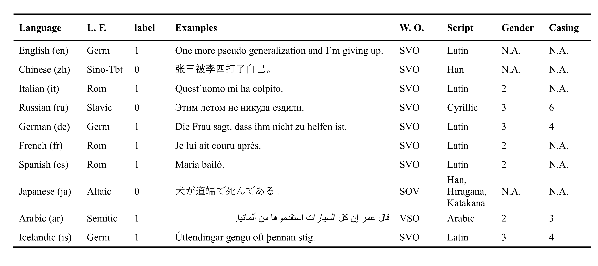

# MELA: Multilingual Evaluation of Linguistic Acceptability

This repository contains data for the MELA (Multilingual Evaluation of Linguistic Acceptability) benchmark. 

**Note that to prevent data contamination, we put the data in a zip file with the password: 200240.**

## News 🔥🔥🔥

**MELA is now available in [lm evaluation harness](https://github.com/EleutherAI/lm-evaluation-harness).**

Now you may evaluate your model on MELA like any other task in the harness:

```
git clone https://github.com/EleutherAI/lm-evaluation-harness
cd lm-evaluation-harness
pip install -e .

lm_eval --model hf --model_args pretrained=[model_name_or_path] --tasks mela --device cuda:0 --num_fewshot 2 --output_path results --log_samples
```

Some models' results:

|model|shot|reported in the paper|lm eval harness|
|-|-|-|-|
|BLOOMZ 7B|0|5.85|5.99±0.85 |
|BLOOMZ 7B|2|4.31| 4.11±0.87 |
|mT0 13B| 0 | 6.62 | 7.72±0.88 |
|mT0 13B| 2 | 7.70 | 5.82±0.75 |
|mTk 13B |0 | 2.24 | 3.16±1.01 |
|mTk 13B |2 | 12.05 | 12.26±0.98 |


## Description

MELA contains 46k acceptable and unacceptable sentences from 10 languages: English, Chinese, Italian, Russian, German, French, Spanish, Japanese, Arabic, and Icelandic. 
Sentences in English, Italian, Russian, and Chinese are consolidated from previous works, which are refered to as *high-resource* languages. 
Samples in other languages (i.e., *low-resource* languages) are sourced from renounced linguistics publications such as syntax textbooks and journal articles. 
In our [paper](https://arxiv.org/abs/2311.09033), we showcase three potential usages of MELA: 
- Benchmarking LLMs
- Cross-lingual transfer
- Syntax acquisition

Here are example sentences from MELA:



## Data

**Note that we have two versions of data splits: 1) ``data/v1.0``, and 2) ``data/v1.1``. Differences lie in *low-resource* language (see prompt in ``prompts.txt``).**

- ``data/v1.0``: We used this version to fine-tune XLM-R, we had to keep a training set of 500 samples for each *low-resource* language. 

- ``data/v1.1``: To better evaluate LLMs, we re-split the data and only keep 100 samples as development set for 6 *low-resource* languages. 
Thus, more data can be utilized to evaluate LLMs. 


## Benchmarking results 

We list the results of several multilingual LLMs (evaluated on ``v1.1``) along with fine-tuned XLM-R (evaluated on ``v1.0``).
Following previous works in linguistic acceptability, we use MCC as the evaluation metric.


## Cross-lingual transfer results

To observe the transfer of acceptability judgements across languages, we train the model on one language, and evaluate it on all 10 development sets.


## Probing results

We train probing classifiers using span representations from XLM-Rs on English probing tasks, including 1) part-of-speech tagging, 2) dependency labeling, 3) constituency labeling, 4) named entity labeling, 5) semantic role labeling, and 6) co-reference.


## Contributors

Ziyin Zhang, Yikang Liu, Weifang Huang, Junyu Mao, Rui Wang, Hai Hu

## Citation

If you use our dataset, please cite us plus all other corpora of linguistic acceptability used in MELA (see ``citations.bib`` file).

```
@inproceedings{DBLP:conf/acl/ZhangLHMWH24,
  author       = {Ziyin Zhang and Yikang Liu and Weifang Huang and Junyu Mao and Rui Wang and Hai Hu},
  editor       = {Lun{-}Wei Ku and Andre Martins and Vivek Srikumar},
  title        = {{MELA:} Multilingual Evaluation of Linguistic Acceptability},
  booktitle    = {Proceedings of the 62nd Annual Meeting of the Association for Computational Linguistics (Volume 1: Long Papers), {ACL} 2024, Bangkok, Thailand, August 11-16, 2024},
  pages        = {2658--2674},
  publisher    = {Association for Computational Linguistics},
  year         = {2024},
  url          = {https://doi.org/10.18653/v1/2024.acl-long.146},
  doi          = {10.18653/V1/2024.ACL-LONG.146}
}
```

